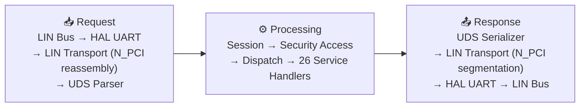

# UDS over LIN — Diagnostic Stack

[](README.md)

[](doc/)
[]()
[]()

> ⚠️ **AI-Generated Notice**: This project is AI-assisted and intended for educational reference only — for learning UDS diagnostic protocol (ISO 14229-1) and LIN bus communication. Not for production use.

A C11 implementation of ISO 14229-1 Unified Diagnostic Services (UDS) for an ECU communicating over LIN.

A complete diagnostic stack built for learning: from physical UART frames up through 26 standard UDS services, source for every layer lives here.

## Table of Contents

- [Architecture](#architecture)
- [Supported Services](#supported-services)
- [Learning Tools](#learning-tools)
- [Build](#build)
- [Test](#test)
- [Fuzz Testing](#fuzz-testing)
- [Directory Structure](#directory-structure)
- [Protocol Documents](#protocol-documents)
- [License](#license)

## Architecture

Bidirectional data flow for diagnostic requests (downstream) and responses (upstream).



### Key Design Decisions

- **Zero dynamic allocation** — no `malloc`. All buffers are pre-allocated at init time, suitable for embedded use.
- **Strict C11** — no GNU extensions, compiled with `-Wall -Werror -Wextra -Wpedantic`.
- **HAL abstraction** — transport layer decoupled from physical layer via `hal_uart.h` interface, swappable with real UART drivers or desktop simulation.
- **POSIX mode** — optionally compile into a Linux executable with real UART (`/dev/ttyS0`), timer (`clock_gettime`), and NVM (file I/O).

#### Core Module Index

| Module | Header | Implementation |
|--------|--------|----------------|
| HAL abstraction | `inc/hal/hal_uart.h` | `src/hal/hal_stubs.c` |
| LIN transport | `inc/uds/uds_lin_transport.h` | `src/uds/uds_lin_transport.c` |
| UDS core | `inc/uds/uds_core.h` | `src/uds/uds_core.c` |
| Session management | `inc/uds/uds_session.h` | `src/uds/uds_session.c` |
| Security access | `inc/uds/uds_security.h` | `src/uds/uds_security.c` |
| DTC management | `inc/uds/uds_dtc.h` | `src/uds/uds_dtc.c` |
| DID data store | `inc/uds/uds_data.h` | `src/uds/uds_data.c` |

## Supported Services

Based on ISO 14229-1:2020. 26 standard UDS services listed by functional group.

| Service | SID | Module |
|---------|-----|--------|
| **Diagnostic & Communication Management** |
| DiagnosticSessionControl | 0x10 | uds_svc_diagcomm |
| ECUReset | 0x11 | uds_svc_diagcomm |
| SecurityAccess | 0x27 | uds_security |
| CommunicationControl | 0x28 | uds_svc_diagcomm |
| TesterPresent | 0x3E | uds_svc_diagcomm |
| ControlDTCSetting | 0x85 | uds_svc_diagcomm |
| ResponseOnEvent | 0x86 | uds_svc_diagcomm |
| LinkControl | 0x87 | uds_svc_diagcomm |
| **Data Transmission** |
| ReadDataByIdentifier | 0x22 | uds_svc_data |
| WriteDataByIdentifier | 0x2E | uds_data |
| ReadMemoryByAddress | 0x23 | uds_svc_upload |
| ReadScalingDataByIdentifier | 0x24 | uds_svc_data |
| WriteMemoryByAddress | 0x3D | uds_svc_data |
| **Stored Data Transmission** |
| ReadDataByPeriodicIdentifier | 0x2A | uds_svc_stored |
| DynamicallyDefineDataIdentifier | 0x2C | uds_svc_stored |
| ClearDiagnosticInformation | 0x14 | uds_dtc |
| ReadDTCInformation | 0x19 | uds_dtc |
| **Input/Output Control** |
| InputOutputControlByIdentifier | 0x2F | uds_svc_io |
| **Remote Routine Activation** |
| RoutineControl | 0x31 | uds_svc_routine |
| **Upload / Download** |
| RequestDownload | 0x34 | uds_svc_upload |
| RequestUpload | 0x35 | uds_svc_upload |
| TransferData | 0x36 | uds_svc_upload |
| RequestTransferExit | 0x37 | uds_svc_upload |
| RequestFileTransfer | 0x38 | uds_svc_upload |
| **Authentication & Security** |
| Authentication | 0x29 | uds_svc_auth |
| SecuredDataTransmission | 0x84 | (stub) |

## Learning Tools

`tools/uds_learning_suite.html` — dual-mode UDS learning suite, open directly in your browser. Zero dependencies, just a modern browser.

| Mode | Features |
|------|----------|
| 📖 Learn | 9 tabs: Service Browser, NRC Reference, SID Map, Session Management, Message Builder, LIN Transport Protocol, DTC Status Bytes, Addressing & Response, LIN-UART Physical Layer |
| 🔌 Simulate | Full ECU simulator: send diagnostic requests, real-time message log, 13 preset scenarios, dark/light theme |

Two additional tools:

- `tools/uds_learning_tool.html` — Simplified UDS concept learning tool.
- `tools/uds_simulator.html` — Standalone UDS message simulator.

## Build

### Desktop Simulation (default)

```bash
# Configure & build (Debug mode with AddressSanitizer)
cmake -B build -DCMAKE_BUILD_TYPE=Debug -DUDS_ASAN=ON
cmake --build build
```

Artifacts:
- `build/libuds-core.a` — linkable diagnostic stack static library
- `build/uds-sim` — PC simulator executable (receives LIN frames, runs the full stack)

### POSIX Real Hardware Mode

```bash
# Build with real POSIX HAL (UART: /dev/ttyS0, Timer: clock_gettime, NVM: file I/O)
cmake -B build -DHAL_PLATFORM=posix
cmake --build build
```

### Compiler Requirements

- C11 compiler (GCC ≥ 5, Clang ≥ 3.8, or MSVC ≥ 2015)
- CMake ≥ 3.14

### Build Options

| Option | Default | Description |
|--------|---------|-------------|
| `UDS_ASAN` | OFF | Enable AddressSanitizer |
| `UDS_UBSAN` | OFF | Enable UndefinedBehaviorSanitizer |
| `HAL_PLATFORM=posix` | — | Use real POSIX HAL instead of stubs |
| `ENABLE_FUZZ` | OFF | Build fuzz test targets |

## Test

```bash
# Run all tests
ctest --test-dir build --output-on-failure
```

## Fuzz Testing

Optional fuzz harnesses for discovering edge-case defects in the parser and transport layer.

```bash
# Build fuzz targets (requires clang/libFuzzer)
cmake -B build -DCMAKE_BUILD_TYPE=Debug -DENABLE_FUZZ=ON \
  -DCMAKE_C_COMPILER=clang
cmake --build build

# Run UDS parser fuzz test
./build/fuzz-uds-parser -max_len=4096 -runs=1000000

# Run LIN transport layer fuzz test
./build/fuzz-lin-transport -max_len=4096 -runs=1000000
```

### Test Suite Overview

| Test Executable | Coverage |
|-----------------|----------|
| `uds-core-test` | Parser / Serializer |
| `uds-session-test` | Session State Machine |
| `uds-lin-transport-test` | LIN Transport Layer (N_PCI) |
| `uds-dtc-test` | DTC State Machine |
| `uds-security-test` | Security Access Seed-Key |
| `uds-did-test` | DID Registry & Access Control |
| `uds-diagcomm-test` | Diagnostic & Communication Services |
| `uds-data-service-test` | Data Transmission Services |
| `uds-io-test` | I/O Control Services |
| `uds-upload-test` | Upload / Download Services |
| `uds-stored-test` | Stored Data Services |
| `uds-routine-test` | Routine Control Services |
| `uds-auth-test` | Authentication Services |
| `uds-lin-sim-test` | LIN Master Simulator |
| `uds-runner-test` | Runner Infrastructure |
| `uds-integration-test` | End-to-End Integration |
| `uds-service-test` | Service Dispatch Routing |

## Directory Structure

```
.
├── CMakeLists.txt                Build system (CMake 3.14+)
├── inc/
│   ├── hal/                      HAL public interface
│   │   ├── hal_uart.h            UART receive/transmit
│   │   ├── hal_timer.h           Timer
│   │   ├── hal_nvm.h             Non-volatile memory
│   │   ├── hal_cfg.h             HAL config constants
│   │   ├── hal_common.h          Common HAL types & status codes
│   │   └── hal_stubs.h           Stub function declarations
│   └── uds/                      UDS stack public interface
│       ├── uds_core.h            Core types / parse / serialize / SID macros
│       ├── uds_session.h         Session management
│       ├── uds_security.h        Security access
│       ├── uds_lin_transport.h   LIN transport layer
│       ├── uds_data.h            DID registry & data storage
│       ├── uds_dtc.h             DTC state machine & status byte masks
│       ├── uds_service.h         27-byte service support list
│       ├── uds_svc_diagcomm.h    Diagnostic & comm management services
│       ├── uds_svc_data.h        Data transmission services
│       ├── uds_svc_stored.h      Stored data transmission services
│       ├── uds_svc_routine.h     Routine control services
│       ├── uds_svc_io.h          I/O control services
│       ├── uds_svc_upload.h      Upload/download services
│       └── uds_svc_auth.h        Authentication services
├── src/
│   ├── hal/
│   │   └── hal_stubs.c           Embedded stubs (empty implementation)
│   └── uds/                      Complete stack source
│       ├── uds_core.c            Parser / Serializer / Utilities
│       ├── uds_session.c         Session state machine + P2 timing
│       ├── uds_security.c        Seed-key challenge/response state machine
│       ├── uds_lin_transport.c   N_PCI frame encode/decode
│       ├── uds_data.c            DID registry / read / write
│       ├── uds_dtc.c             DTC set / clear / snapshot
│       ├── uds_service.c         SID routing table + service support list
│       ├── uds_svc_diagcomm.c    8 diagnostic & comm management services
│       ├── uds_svc_data.c        5 data transmission services
│       ├── uds_svc_stored.c      2 stored + DTC services
│       ├── uds_svc_routine.c     Routine control (start/stop/query results)
│       ├── uds_svc_io.c          I/O control (short/long parameter returns)
│       ├── uds_svc_upload.c      5 upload/download services
│       └── uds_svc_auth.c        Authentication + PKI verification
├── sim/
│   ├── main_sim.c                PC simulator main loop
│   └── sim_cfg.h                 Simulator tuning constants
├── test/
│   ├── lin_sim/                  LIN master simulation helpers
│   ├── mock/                     Mock HAL (for desktop testing)
│   ├── test_core.c               Core parse/serialize tests
│   ├── test_session.c            Session state machine tests
│   ├── test_lin_transport.c      LIN transport layer tests
│   ├── test_dtc.c                DTC state machine tests
│   ├── test_security.c           Security access tests
│   ├── test_did.c                DID registry tests
│   ├── test_svc_diagcomm.c       Diagnostic comm service tests
│   ├── test_svc_data.c           Data transmission service tests
│   ├── test_svc_io.c             I/O control service tests
│   ├── test_svc_upload.c         Upload/download service tests
│   ├── test_svc_stored.c         Stored data service tests
│   ├── test_svc_routine.c        Routine control service tests
│   ├── test_svc_auth.c           Authentication service tests
│   ├── test_svc_service.c        Service dispatch routing tests
│   ├── test_lin_sim.c            LIN master simulator tests
│   ├── test_uds_runner.c         Test runner infrastructure
│   ├── test_uds_integration.c    End-to-end integration tests
│   └── fuzz/                     Fuzz test targets
├── tools/
│   ├── uds_learning_suite.html   Main learning suite (learn + simulate dual mode)
│   ├── uds_learning_tool.html    Simplified learning tool
│   └── uds_simulator.html        Standalone message simulator
├── doc/
│   └── ISO 14229-*               Complete protocol standards (PDF + TXT extraction)
├── local_unity/                  Unity test framework (v2.6.1, vendored)
└── README.md                     This file
```

## Protocol Documents

Authoritative standards the implementation is based on.

| Standard | Year | Content |
|----------|------|---------|
| ISO 14229-1:2020 | 2020 | UDS Application Layer — all 26 services |
| ISO 14229-2:2013 | 2013 | UDS Session Layer — P2/P2\*/S3 timing |
| ISO 14229-3:2012 | 2012 | UDS on CAN |
| ISO 14229-4:2012 | 2012 | UDS on FlexRay |
| ISO 14229-5:2013 | 2013 | UDS on IP (DoIP) |
| ISO 14229-6:2013 | 2013 | UDS on K-Line |
| **ISO 14229-7:2015** | **2015** | **UDS on LIN** |
| ISO 14229-8:2020 | 2020 | UDS on Clock Extension |
| ISO 17987-2 | — | LIN Transport Layer (N_PCI) |
| ISO 17987-3 | — | LIN Data Link Layer |

> Note: TXT files are PDF text extractions; tables, figures, and some numeric values may be incomplete. For precise protocol verification, consult original PDF documents.

## License

MIT License

Copyright (c) 2025
